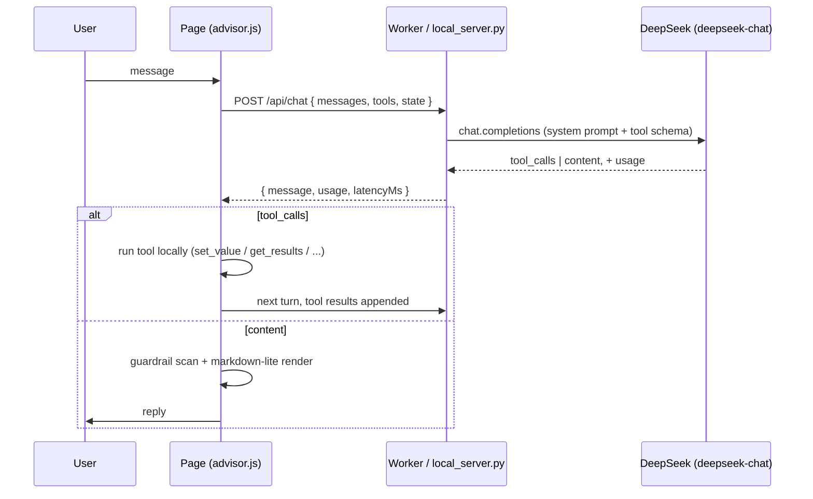

# Goalden

A financial-planning app with an AI advisor that drives the real interface —
it doesn't just chat, it sets sliders, runs the actual calculation engine,
and hands back a report built from numbers it just recomputed and verified.
Three entry points share one math engine and one advisor:

| Door | File | Depth |
|---|---|---|
| Quick Calculate | [`goalden.html`](goalden.html) | Level 1 — single goal, ~2 min |
| The Full Plan | [`goalden-door2.html`](goalden-door2.html) | Level 2 — risk-profiled multi-goal plan, 10–15 min |
| The Lab | [`goalden-lab.html`](goalden-lab.html) | Level 3 — every assumption exposed, efficient frontier, Monte Carlo, live market data |

No build step, no framework, no bundler — four static HTML pages plus a
handful of plain `<script>` files. That constraint is deliberate (see
[`ROADMAP.md`](ROADMAP.md)): it keeps the whole system inspectable in a
single file open, which matters as much for a technical interview as it does
for a user's trust in a finance tool.

## Agent architecture

The advisor is a real tool-calling agent, not a wrapper around a chat
completion. It runs a ReAct-style loop (`advisor.js` → `advisorLoop`)
against 51 tool definitions spread across the four pages: read state
(`get_state`, `get_results`), write state (`set_value`, `navigate`), and two
compound "skill" tools (`build_goal_plan`, `run_full_analysis`) that collapse
what used to take 7–11 individual tool calls into one.



Every tool call executes against the page's own live DOM and state — the
model never gets to fabricate a number. `set_value` routes through the same
field-spec validator (type, enum, min/max) whether a human or the model is
driving. Three layers sit on top of that base loop:

- **Verification layer.** Before a briefing renders, the page re-runs
  [`goalden-engine.js`](goalden-engine.js) — the same math the UI itself
  uses — from current state and diffs every figure the briefing is about to
  assert. A mismatch blocks the render (`figure_mismatch`) instead of
  shipping a wrong number. The advice guardrail (no naming instruments, no
  price predictions) is enforced by scanning outgoing text in code
  (`advisorGuardrail`), not left to prompt instructions alone.
- **Plan objects + human approval.** For any multi-field change, the model
  can call `propose_plan(steps)` instead of acting immediately. It renders
  as a real checklist in the chat (checkboxes, not prose) that the user
  edits and approves before `execute_plan` runs only the checked steps, in
  order, through the exact same tool dispatch as everything else.
- **Dev trace panel** (🔍 in the advisor header). Every `/api/chat` round
  trip is logged client-side with its tool calls, round-trip and upstream
  latency, and token usage straight from DeepSeek's `usage` block — plus a
  running session total and a cost estimate. This is what makes "cost per
  plan" and "latency per plan" measurable claims instead of guesses.

## Shared engine + eval harness

`goalden-engine.js` holds the money math (`corpusRequired`, `solveSIP`,
`realRate`, `inflateExpense`, …) as one extracted, tested module — it's what
the UI, the verification layer, and the AI's tools all call, so there is
exactly one place a formula can be wrong. Covered by
[`engine.test.js`](engine.test.js) (`node --test`).

[`agent-evals/`](agent-evals) is a headless eval harness for the agent
itself — the piece most similar projects skip. `runner.js` drives the real
`advisorLoop` (loaded into a Node `vm` context, real tool execution, no
reimplemented mock) against 15 scenarios in `scenarios.json`, asserting on
which tools got called, which fields got set, and whether the figures match
`goalden-engine.js` computed independently. Re-run it after any prompt or
tool-schema change:

```bash
node agent-evals/runner.js
```

## Live-data proxy (Cloudflare Worker)

The Lab's "Live Frontier" tool fetches real market data (Yahoo Finance for
equities/ETFs, MFAPI.in for Indian mutual fund NAVs) through a small proxy
worker, because both are blocked by CORS when called directly from a
browser. The proxy also normalises both sources to one response shape and
strips a null-close bug on Yahoo's most recent bar.

- Worker code: [`src/worker.js`](src/worker.js)
- Config: [`wrangler.toml`](wrangler.toml) — serves the static site (this
  repo root) via the `[assets]` binding, and routes only `/api/*` to the
  worker's `fetch` handler.

Routes:

| Route | Example | Source |
|---|---|---|
| `GET /api/history?type=equity&symbol=TITAN.NS` | NSE-listed equity/ETF daily bars | Yahoo Finance chart endpoint |
| `GET /api/history?type=fund&scheme=119551` | Mutual fund NAV history | MFAPI.in |
| `GET /api/fundsearch?q=gilt` | Fund name / scheme-code search | MFAPI.in |

All three return `{ id, label, currency, prices: [{ date, close }, ...] }`,
oldest-first.

**To run and deploy:**

```bash
npm install -g wrangler
wrangler dev
```

Then confirm all three routes above return real data, and that everything
else (`/`, `/goalden.html`, etc.) still serves the static site. Deploy with:

```bash
wrangler deploy
```

You may need to switch the Cloudflare Pages/Workers project off pure
static-asset mode to pick up the worker script, depending on how it is
currently configured.
